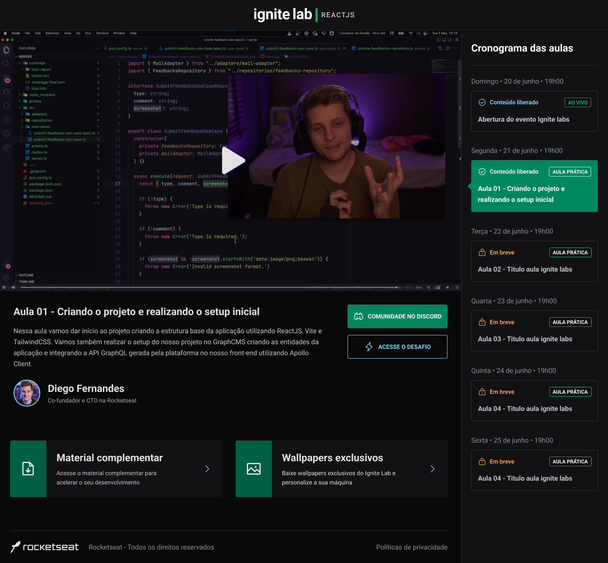

  

🚀Projeto do Evento Ignite Lab proposto pela rocketseat composto de 5 aulas de puro contéudo sobre ReactJS

  
  
  

 <a href="#objetivo">Objetivo</a> •
 <a href="#funcionalidades">Funcionalidades</a> • 
 <a href="#pre-req">Pré-requisitos</a> • 
 <a href="#tecnologias">Tecnologias</a> • 
 <a href="#autor">Autor</a> • 
 <a href="#license">License</a>

<h4 align="center"> 
	🚧  Plataforma de Evento - Ignite Lab🚀 Concluído.  🚧
</h4>

<h3 id="objetivo">Objetivo 🎯</h3>

Desenvolver um site da plataforma do evento Ignite Lab, onde o usuário poderá se cadastrar e acessar os vídeos e materiais do evento.

 

<h3 id="funcionalidades">Funcionalidades</h3>

- [x] Criar uma página de login usando GraphQL.
  - [x] Direciona as mutations para o schema do GraphCMS.
- [x] Criar um HeadlessCMS para cadastrar os dados do eventos (vídeos, professores, etc.)
  - [x] Fazer requisições usando Apollo e mostrar esses dados estilizados para o usuário.
- [] Responsividade (under development)

Link para testes e uso do site [neste link](https://ignite-lab-reactjs-one.vercel.app/)

Layout do projeto: 

  
  

<h1 id="tecnologias">🛠 Tecnologias</h1>

As seguintes tecnologias foram usadas na construção do projeto:
- [React](https://pt-br.reactjs.org/)
- [TypeScript](https://www.typescriptlang.org/)
- [TailwindCSS](https://tailwindcss.com/)
- [Apollo](https://www.apollographql.com/)
- [GraphQL](https://graphql.org/)
- [GraphCMS](https://graphcms.com/)
- [GraphQL Code Generator](https://www.graphql-code-generator.com/)
### Deploy
- [Vercel](https://vercel.com/)

<h1 id="autor">Autor</h1>

<a href="https://github.com/davivsouza/">
 
  
 <b>Davi Souza</b></a> <a href="https://github.com/davivsouza/" title="Davi V. Souza">🕊</a>

Feito com 💜 por Davi V. Souza  👋🏽 Entre em contato!

 

<h1 id="license">License</h1>
MIT